# MoE Technical Report

## 1. MoE 与 EP 简述

### 1.1 MoE 的结构

MoE（Mixture of Experts，混合专家模型）是一种通过门控网络将不同 token 或样本分配给不同“专家”子网络处理的稀疏计算架构，其核心思想是在扩大模型总参数规模的同时，只激活其中一小部分参数参与计算，从而提升容量与计算效率。MoE 的发展大致经历了三个阶段：早期阶段以“门控网络选择局部专家”为核心，MoE 主要是一种分治式建模思想；规模化阶段从 Google 的 **Sparsely-Gated MoE** 开始，它率先把 MoE 用到大规模语言建模中，通过 noisy top-k 路由只激活部分专家，但还没有共享专家设计；Transformer 阶段以 **Switch Transformer** 为代表，它将 MoE 接入 T5/Transformer 架构，并把路由简化为 **top-1**，每个 token 只进入一个专家，同样属于纯 routed experts；进入现代 LLM 阶段后，Mixtral、DeepSeekMoE、DeepSeek-V2/V3 等模型推动 MoE 走向开源和商用，其中“共享专家”并非 DeepSeekMoE 最早发明，但 DeepSeekMoE 将 **shared experts + routed experts** 明确结构化，用共享专家承载通用知识、路由专家承载差异化能力，成为后续 MoE LLM 的重要设计方向。

### 1.2 MoE 的并行策略：EP

EP（Expert Parallelism，专家并行）是 MoE 推理和训练中专门用于分布式部署专家层的并行方式：与数据并行复制整层参数、张量并行切分单个矩阵不同，EP 将一层 MoE 中的多个专家按 expert id 分布到不同 rank/device 上，每个 rank 只常驻其中一部分本地专家参数；当 gate 为 token 选出目标专家后，系统需要把 token 副本 dispatch 到对应专家所在的 rank，在本地完成专家 FFN 计算，再通过 combine 将结果按原 token 顺序和路由权重聚合回来。因此，EP 的核心通信模式通常是 routed tokens 的 all-to-all，而 EP world size 记为 `P` 时，若共有 `E` 个 routed experts 且无额外冗余复制，理想情况下每个 EP rank 持有 `E_l=E/P` 个本地专家；如果启用 EPLB 或冗余专家，则还会引入 logical expert 到 physical expert 的映射，但 token 路由、跨 rank dispatch 和结果 combine 的基本语义不变。

### 1.3 DeepSeek-V3.2 的 MoE 数据流

DeepSeek-V3.2 的模型结构与 DeepSeek-V3.2-Exp 相同，官方技术报告说明它相对 DeepSeek-V3.1-Terminus 的主要结构变化是引入 DeepSeek Sparse Attention（DSA），因此 FFN/MoE 部分可以按 DeepSeek-V3 系列的 shared experts + routed experts 结构理解。其公开配置为：`hidden_size=7168`，`moe_intermediate_size=2048`，`n_routed_experts=256`，`n_shared_experts=1`，`num_experts_per_tok=8`，`n_group=8`，`topk_group=4`，`scoring_func=sigmoid`，`routed_scaling_factor=2.5`，`first_k_dense_replace=3`，也就是前 3 层使用 dense FFN，后续层按 MoE FFN 执行。

完整 MoE 层包含两条分支：一条是 gated routed-expert 分支，另一条是始终激活的 shared-expert 分支。你给出的 `gate -> dispatch -> permute -> all2all -> permute -> gmm -> swiglu -> gmm -> unpermute -> all2all -> unpermute -> combine` 描述的是 routed-expert 分支，逻辑上是正确的；在 vLLM Ascend 实现里，`npu_moe_distribute_dispatch_v2` 会把 dispatch、permute 和 all-to-all 的部分动作融合，A3 W8A8 decode 场景还可能进一步用 `dispatch_gmm_combine_decode` 把 dispatch、GMM、SwiGLU、combine 打包成 fused kernel，但展开后的数据流仍可按下表理解。

符号约定如下：`T` 表示当前 EP rank 输入 MoE 层的 token 数；`P` 表示 expert-parallel world size，即参与专家并行的 rank/device 数；`H=7168`；`I=2048`；`E=256`；`K=8`；`S=1`；`E_l=E/P`；`N=T*K`；`M_r` 表示 rank `r` 在第一次 all-to-all 后实际收到的 routed token 副本数；`alpha=2.5` 表示 routed branch 的缩放系数 `routed_scaling_factor`。下面的实际数值以 A3 常见 `P=16`、单 rank `T=64` 为例，因此 `E_l=16`、`N=512`，`M_r` 均衡时约为 `512`，但运行时会随路由分布变化。表中的权重 shape 按矩阵乘法输入维在前的逻辑形状书写，实际实现可能以 PyTorch `[out,in]` 或 Ascend NZ/量化格式存储。

| Step | Input | Output | Shape |
|---|---|---|---|
| Input | hidden states `X` | `X` | `[T,H] = [64,7168]` |
| Gate | `X`, gate weight `W_g` | router logits | `W_g: [H,E] = [7168,256]`; logits: `[T,E] = [64,256]` |
| Top-k routing | logits | `expert_ids`, `expert_weights` | `[T,K] = [64,8]`; 从 `8` 个 expert group 中选 `topk_group=4` 组，再选 `K=8` 个专家 |
| Dispatch | `X`, `expert_ids`, `expert_weights` | expanded token copies | `[N,H] = [512,7168]`; 同时保留 token/expert/weight 元数据 |
| Permute by EP rank | expanded token copies | send buffer | `[N,H] = [512,7168]`; `send_counts: [P] = [16]` |
| All-to-all dispatch | send buffer | received token copies | `[M_r,H] = [M_r,7168]`; 均衡时 `M_r≈512` |
| Permute by local expert | received token copies | expert-contiguous token copies | `[M_r,H]`; `expert_token_nums: [E_l] = [16]` |
| GMM 1 | token copies, local `W13` | gate/up projection | `W13: [E_l,H,2I] = [16,7168,4096]`; output: `[M_r,4096]` |
| SwiGLU | gate/up projection | activated expert states | `[M_r,2I] -> [M_r,I] = [M_r,2048]` |
| GMM 2 | activated expert states, local `W2` | expert outputs | `W2: [E_l,I,H] = [16,2048,7168]`; output: `[M_r,7168]` |
| Unpermute by local order | expert outputs | all-to-all return buffer | `[M_r,7168]` |
| All-to-all combine | return buffer | routed outputs on source rank | `[N,H] = [512,7168]` |
| Unpermute by route order | routed outputs | per-token top-k outputs | `[T,K,H] = [64,8,7168]` |
| Combine | per-token outputs, `expert_weights` | routed branch output | `[T,H] = [64,7168]`; 对 `K=8` 个专家输出加权求和 |
| Shared expert | `X` | shared branch output | `W13_shared: [H,2I] = [7168,4096]`; SwiGLU 后 `[T,I] = [64,2048]`; `W2_shared: [I,H] = [2048,7168]`; output `[T,H]` |
| Final add | routed branch `Y_routed`, shared branch `Y_shared` | MoE output | `Y = Y_shared + alpha * Y_routed`; shape `[T,H] = [64,7168]` |

```mermaid
flowchart LR
    X["X hidden_states\n[T,H] = [64,7168]"]
    Gate["Gate\nW_g [7168,256]\nlogits [64,256]"]
    TopK["Group-limited top-k\nids/weights [64,8]"]
    Dispatch["Dispatch / expand\n[N,H] = [512,7168]"]
    P1["Permute by EP rank\nsend_counts [16]"]
    A2A1["All-to-all dispatch\n[M_r,7168]"]
    P2["Permute by local expert\nexpert_token_nums [16]"]
    GMM1["GMM 1\nW13 [16,7168,4096]\n[M_r,4096]"]
    SwiGLU["SwiGLU\n[M_r,4096] -> [M_r,2048]"]
    GMM2["GMM 2\nW2 [16,2048,7168]\n[M_r,7168]"]
    UP1["Unpermute local\n[M_r,7168]"]
    A2A2["All-to-all combine\n[512,7168]"]
    UP2["Unpermute route order\n[64,8,7168]"]
    Combine["Combine top-k outputs\nweighted sum -> [64,7168]"]
    Shared["Shared expert x1\nGMM1 + SwiGLU + GMM2\n[64,7168] -> [64,7168]"]
    Scale["Scale routed branch\nalpha = 2.5"]
    Out["MoE output\nY_shared + alpha * Y_routed\n[64,7168]"]

    X --> Gate --> TopK --> Dispatch
    X --> Dispatch
    Dispatch --> P1 --> A2A1 --> P2 --> GMM1 --> SwiGLU --> GMM2 --> UP1 --> A2A2 --> UP2 --> Combine --> Scale --> Out
    X --> Shared --> Out
```

本仓库实现与上述描述基本一致：`vllm_ascend/models/deepseek_v4.py` 中的 `DeepseekV4MoE` 使用 `ReplicatedLinear(config.hidden_size, config.n_routed_experts)` 生成 gate logits，并以 `num_experts_per_tok=8`、`n_group=8`、`topk_group=4` 创建 `FusedMoE`；`vllm_ascend/ops/fused_moe/token_dispatcher.py` 的 MC2 dispatcher 返回 `expand_x`、`expert_token_nums`、`assist_info_for_combine` 等元数据，对应上表中的 dispatch、分组和 combine 信息；`tests/e2e/nightly/single_node/ops/multicard_ops_a3/test_dispatch_gmm_combine_decode.py` 使用 `token_hidden_size=7168`、`moe_intermediate_size=2048`、`top_k=8`、`ep_world_size=16` 验证 fused decode 路径，其中测试里的 `moe_expert_num=64` 是算子测试规模，完整 DeepSeek-V3.2 配置为 `256` 个 routed experts。

#### References

- [DeepSeek-V3.2 Technical Report](https://arxiv.org/abs/2512.02556)
- [DeepSeek-V3.2 model card](https://huggingface.co/deepseek-ai/DeepSeek-V3.2)
- [DeepSeek-V3.2 config.json](https://huggingface.co/deepseek-ai/DeepSeek-V3.2/blob/main/config.json)

## 2. Expert Parallelism Load Balancer (EPLB)

### 2.1 EPLB 的动机与思想

在 Expert Parallelism 中，每个 rank 只持有部分专家参数，token 会根据路由结果被发送到目标专家所在的 rank；因此 MoE 层的实际耗时不只取决于总 token 数，还取决于这些 token 在专家和 rank 间的分布是否均衡。实际模型中，专家路由往往天然呈现长尾分布：部分专家因为承载特定领域或高频模式而持续更热，另一些专家则相对冷门。[DeepSeek-V3 技术报告](https://arxiv.org/abs/2412.19437)将 MoE 工程效率作为核心问题之一，并采用辅助损失无关的负载均衡、冗余专家和通信优化来降低训练与推理成本；近期关于 EP 服务的研究，如 [Least-Loaded Expert Parallelism](https://arxiv.org/abs/2601.17111) 和 [METRO](https://arxiv.org/abs/2512.09277)，也都指出 EP 默认假设“专家访问大致均衡”，但真实服务中热点专家会导致部分设备成为慢节点，从而拉高整层延迟。

EPLB（Expert Parallelism Load Balancer）的核心思想是在不改变模型语义的前提下，对专家的物理部署进行动态调整：系统先统计每个专家在一段时间内的访问热度，再根据热度估计各 rank 的负载，将热点专家复制为冗余物理专家，并重新生成 logical expert 到 physical expert 的映射，使后续 routed tokens 能被分流到更空闲的 rank 上。换言之，EPLB 不改变 gate 选择的 logical expert，也不改变专家计算本身，而是在执行层面通过“热度统计、冗余复制、放置重排和映射更新”降低最热 rank 的负载峰值。对于使用 group-limited routing 的 MoE 模型，理想的 EPLB 还应同时考虑专家组与硬件拓扑的关系，使同组专家尽量位于通信距离更近的设备或节点内，从而兼顾计算均衡和 all-to-all 通信开销。

### 2.2 EPLB 性能收益的数学建模

### 2.3 EPLB 的具体工作

### 2.4 EPLB 策略算法

## 3. 冗余专家

## 4. 共享专家混置

## 5. vLLM Ascend 中 EPLB 的现状与发展
