# MoE Technical Report

## 1. MoE 与 EP 简述

### 1.1 MoE 的结构

MoE（Mixture of Experts，混合专家模型）是一种稀疏计算结构。它把 FFN 层拆成多个“专家”，再用 gate 为每个 token 选择少量专家参与计算。这样，模型总参数量可以很大，但单个 token 只激活其中一小部分参数，从而在容量和计算成本之间取得平衡。

从执行角度看，MoE 层通常包含三类组件：gate 负责计算 token 应该进入哪些专家；routed experts 只处理被选中的 token；shared experts 则通常对所有 token 生效，用来承载更通用的能力。

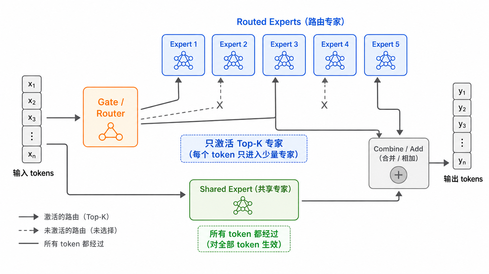

_图 1-1 MoE 的结构。_

从发展脉络看，早期 MoE 更接近“门控网络选择局部专家”的分治思想；规模化阶段以 **Sparsely-Gated MoE** 为代表，通过 noisy top-k 路由只激活部分专家；Transformer 阶段以 **Switch Transformer** 为代表，将 MoE 接入 Transformer FFN；现代 LLM 阶段中，Mixtral、DeepSeekMoE、DeepSeek-V2/V3 等模型进一步推动了 routed experts 与 shared experts 的组合设计。

### 1.2 MoE 的并行策略：EP

EP（Expert Parallelism，专家并行）是 MoE 中专门用于分布式部署专家层的并行方式。与数据并行复制整层参数、张量并行切分单个矩阵不同，EP 会把一层 MoE 中的多个专家按 expert id 分布到不同 rank/device 上，每个 rank 只常驻其中一部分本地专家参数。

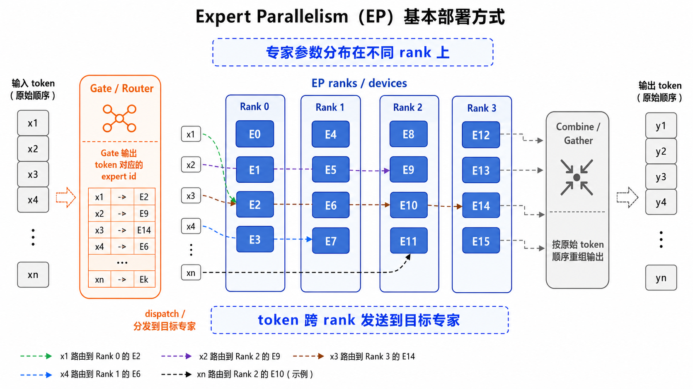

_图 1-2 EP 部署方式。_

当 gate 为 token 选出目标专家后，系统需要把 token 副本 dispatch 到对应专家所在的 rank，在本地完成专家 FFN 计算，再通过 combine 将结果按原 token 顺序和路由权重聚合回来。因此，EP 的核心通信模式通常是 routed tokens 的 all-to-all。

记 EP world size 为 `P`，routed expert 总数为 `E`。若没有冗余复制，理想情况下每个 EP rank 持有 `E_l=E/P` 个本地专家；如果启用 EPLB 或冗余专家，还会引入 logical expert 到 physical expert 的映射，但 token 路由、跨 rank dispatch 和结果 combine 的基本语义不变。

### 1.3 DeepSeek-V3.2 的 MoE 数据流

DeepSeek-V3.2 的模型结构与 DeepSeek-V3.2-Exp 相同，官方技术报告说明它相对 DeepSeek-V3.1-Terminus 的主要结构变化是引入 DeepSeek Sparse Attention（DSA），因此 FFN/MoE 部分可以按 DeepSeek-V3 系列的 shared experts + routed experts 结构理解。其公开配置为：`hidden_size=7168`，`moe_intermediate_size=2048`，`n_routed_experts=256`，`n_shared_experts=1`，`num_experts_per_tok=8`，`n_group=8`，`topk_group=4`，`scoring_func=sigmoid`，`routed_scaling_factor=2.5`，`first_k_dense_replace=3`，也就是前 3 层使用 dense FFN，后续层按 MoE FFN 执行。

完整 MoE 层包含两条分支：一条是 gated routed-expert 分支，另一条是始终激活的 shared-expert 分支。理解下面的数据流时，先抓住三件事：gate 先选专家；dispatch 把 token 发到专家所在 rank；专家计算完成后再 combine 回原 token 顺序。

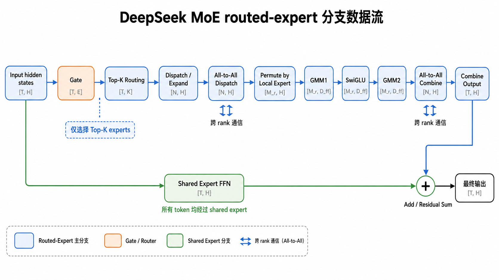

_图 1-3 DeepSeek-V3.2 的 MoE 数据流。_

在 vLLM Ascend 实现里，`npu_moe_distribute_dispatch_v2` 会把 dispatch、permute 和 all-to-all 的部分动作融合，A3 W8A8 decode 场景还可能进一步用 `dispatch_gmm_combine_decode` 把 dispatch、GMM、SwiGLU、combine 打包成 fused kernel。但从逻辑上看，routed-expert 分支仍可展开为 `gate -> dispatch -> all-to-all -> expert FFN -> all-to-all -> combine`。

下表以 A3 常见配置为例：EP world size `P=16`，单 rank 输入 token 数 `T=64`，routed expert 数 `E=256`，每个 token 选择 `K=8` 个 expert。因此每个 rank 理想持有 `E_l=E/P=16` 个专家，单 rank 会产生 `N=T*K=512` 个 routed token 副本。其他符号含义如下：

| Symbol | Meaning |
|---|---|
| `H=7168` | hidden size |
| `I=2048` | expert intermediate size |
| `M_r` | rank `r` 在第一次 all-to-all 后收到的 token 副本数 |
| `alpha=2.5` | routed branch 的缩放系数 `routed_scaling_factor` |

表中的权重 shape 按矩阵乘法输入维在前的逻辑形状书写，实际实现可能以 PyTorch `[out,in]` 或 Ascend NZ/量化格式存储。

| Step | Input | Output | Shape |
|---|---|---|---|
| Input | hidden states `X` | `X` | `[T,H] = [64,7168]` |
| Gate | `X`, gate weight `W_g` | router logits | `W_g: [H,E] = [7168,256]`; logits: `[T,E] = [64,256]` |
| Top-k routing | logits | `expert_ids`, `expert_weights` | `[T,K] = [64,8]`; 从 `8` 个 expert group 中选 `topk_group=4` 组，再选 `K=8` 个专家 |
| Dispatch | `X`, `expert_ids`, `expert_weights` | expanded token copies | `[N,H] = [512,7168]`; 同时保留 token/expert/weight 元数据 |
| Permute by EP rank | expanded token copies | send buffer | `[N,H] = [512,7168]`; `send_counts: [P] = [16]` |
| All-to-all dispatch | send buffer | received token copies | `[M_r,H] = [M_r,7168]`; 均衡时 `M_r≈512` |
| Permute by local expert | received token copies | expert-contiguous token copies | `[M_r,H]`; `expert_token_nums: [E_l] = [16]` |
| GMM 1 | token copies, local `W13` | gate/up projection | `W13: [E_l,H,2I] = [16,7168,4096]`; output: `[M_r,4096]` |
| SwiGLU | gate/up projection | activated expert states | `[M_r,2I] -> [M_r,I] = [M_r,2048]` |
| GMM 2 | activated expert states, local `W2` | expert outputs | `W2: [E_l,I,H] = [16,2048,7168]`; output: `[M_r,7168]` |
| Unpermute by local order | expert outputs | all-to-all return buffer | `[M_r,7168]` |
| All-to-all combine | return buffer | routed outputs on source rank | `[N,H] = [512,7168]` |
| Unpermute by route order | routed outputs | per-token top-k outputs | `[T,K,H] = [64,8,7168]` |
| Combine | per-token outputs, `expert_weights` | routed branch output | `[T,H] = [64,7168]`; 对 `K=8` 个专家输出加权求和 |
| Shared expert | `X` | shared branch output | `W13_shared: [H,2I] = [7168,4096]`; SwiGLU 后 `[T,I] = [64,2048]`; `W2_shared: [I,H] = [2048,7168]`; output `[T,H]` |
| Final add | routed branch `Y_routed`, shared branch `Y_shared` | MoE output | `Y = Y_shared + alpha * Y_routed`; shape `[T,H] = [64,7168]` |

本仓库实现与上述描述基本一致：`vllm_ascend/models/deepseek_v4.py` 中的 `DeepseekV4MoE` 使用 `ReplicatedLinear(config.hidden_size, config.n_routed_experts)` 生成 gate logits，并以 `num_experts_per_tok=8`、`n_group=8`、`topk_group=4` 创建 `FusedMoE`；`vllm_ascend/ops/fused_moe/token_dispatcher.py` 的 MC2 dispatcher 返回 `expand_x`、`expert_token_nums`、`assist_info_for_combine` 等元数据，对应上表中的 dispatch、分组和 combine 信息；`tests/e2e/nightly/single_node/ops/multicard_ops_a3/test_dispatch_gmm_combine_decode.py` 使用 `token_hidden_size=7168`、`moe_intermediate_size=2048`、`top_k=8`、`ep_world_size=16` 验证 fused decode 路径，其中测试里的 `moe_expert_num=64` 是算子测试规模，完整 DeepSeek-V3.2 配置为 `256` 个 routed experts。

#### References

- [DeepSeek-V3.2 Technical Report](https://arxiv.org/abs/2512.02556)
- [DeepSeek-V3.2 model card](https://huggingface.co/deepseek-ai/DeepSeek-V3.2)
- [DeepSeek-V3.2 config.json](https://huggingface.co/deepseek-ai/DeepSeek-V3.2/blob/main/config.json)

## 2. Expert Parallelism Load Balancer (EPLB)

### 2.1 MoE 层耗时来源分析

在 Expert Parallelism 中，每个 rank 只持有一部分专家参数。Gate 选出目标专家后，token 会被发送到对应专家所在的 rank，因此 MoE 层耗时不仅取决于 token 总量，还取决于 token 在专家和 rank 间的分布。

从执行路径看，routed-expert 分支的尾延迟主要来自两部分：一类是 expert FFN 计算延迟，另一类是 dispatch/combine 的 all-to-all 通信延迟。两者都会被 expert 负载不均衡放大。

本节的公式用于说明负载不均衡如何影响尾延迟，不是对硬件 kernel 的精确性能建模。实际延迟还会受到算子实现、网络拓扑、buffer 管理和调度策略影响。

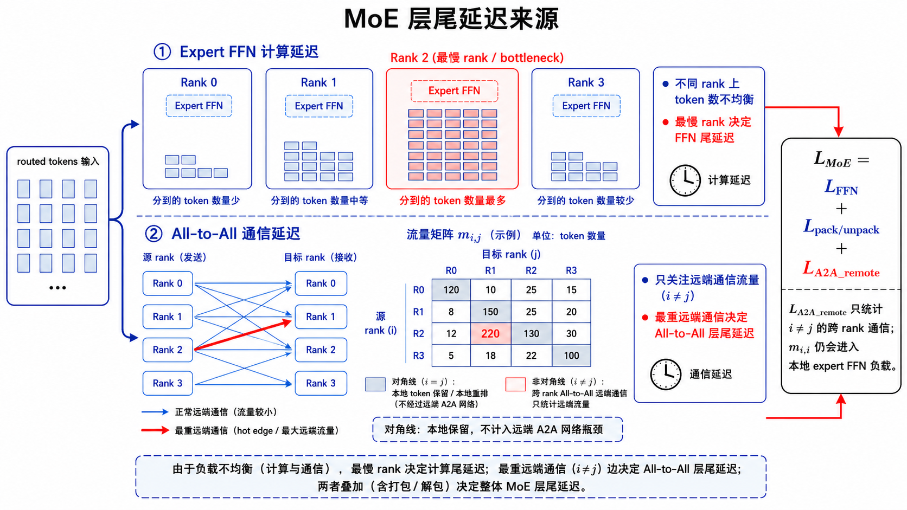

_图 2-1 MoE 层耗时来源。_

#### 2.1.1 Expert FFN 计算延迟

设第 $p$ 个 EP rank 实际处理的 routed token 副本数为 $n_p$，总 token 副本数为：

$$
N = \sum_{p=1}^{P} n_p
$$

平均负载为 $\bar n=N/P$，expert 侧负载不均衡比定义为：

$$
\mathrm{LIR}_{exp} = \frac{\max_p n_p}{\bar n}
$$

因此最慢 rank 的 token 数为：

$$
\max_p n_p = \frac{N}{P} \cdot \mathrm{LIR}_{exp}
$$

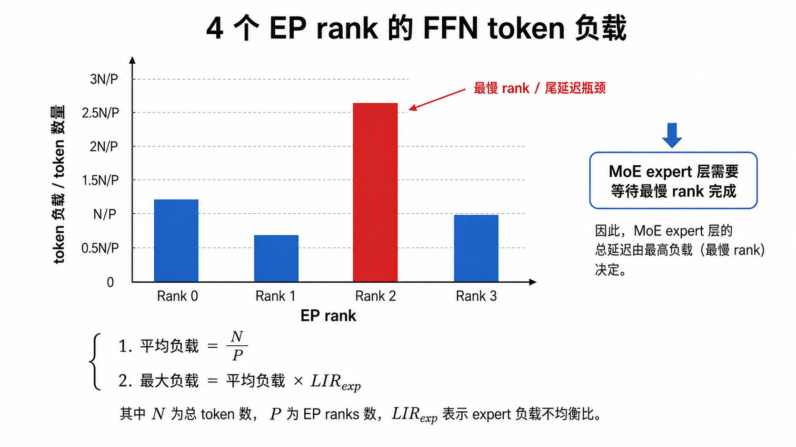

_图 2-2 Expert FFN 计算延迟由最慢 rank 决定。_

MoE expert 层需要等待最慢 rank 完成。若把单 rank FFN 时延拆成固定开销、近似线性的 GEMM 计算项，以及由 memory bottleneck、cache miss、kernel inefficiency 等引入的非理想项，则可写成一个简化经验模型：

$$
L_{\mathrm{FFN}} \approx L_{\mathrm{ovh}}^{\mathrm{ffn}} + c_{comp} \cdot \frac{N}{P} \mathrm{LIR}_{exp} + c_{bw} \cdot \sqrt{\frac{N}{P} \mathrm{LIR}_{exp}}
$$

其中 $L_{\mathrm{ovh}}^{\mathrm{ffn}}$ 表示 runtime scheduling、kernel launch、同步等固定开销；$c_{comp}$ 表示单 token FFN 计算成本；$c_{bw}$ 表示带宽和 kernel 非理想效率带来的成本。平方根项不是严格数学推导，而是用来表达非理想开销随 token 数增长但通常弱于主 GEMM 线性项。该式想强调的核心结论是：expert 负载越不均衡，最慢 rank 的 FFN 计算延迟越高。

#### 2.1.2 All-to-All 通信延迟

MoE dispatch 阶段的 all-to-all 可以抽象为源 rank 到目标 rank 的流量矩阵 $m_{i,j}$，单条通信延迟近似为：

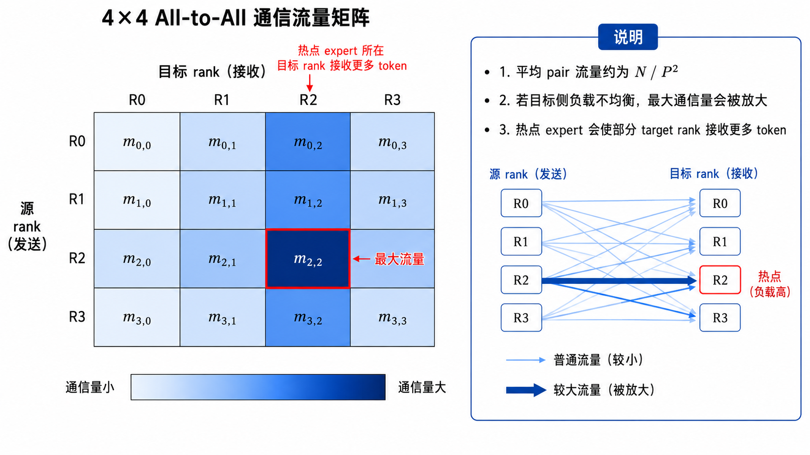

_图 2-3 All-to-All 流量矩阵。_

$$
L_{i,j} = \frac{m_{i,j}}{B} + L_{\mathrm{ovh}}^{\mathrm{comm}}
$$

其中 $B$ 是有效带宽，$L_{\mathrm{ovh}}^{\mathrm{comm}}$ 是固定通信开销。all-to-all 整体延迟主要由最慢通信决定：

$$
L_{\mathrm{comm}} = \mathbb{E}[\max_{i,j} L_{i,j}]
$$

定义源侧发送负载和目标侧接收负载：

$$
a_i = \sum_j m_{i,j}, \quad b_j = \sum_i m_{i,j}
$$

用 LIR 刻画两侧倾斜程度：

$$
\mathrm{LIR}_{src} = \frac{\max_i a_i}{N/P}, \quad \mathrm{LIR}_{dst} = \frac{\max_j b_j}{N/P}
$$

在源侧负载近似均匀时，$\mathrm{LIR}_{src} \approx 1$；目标侧接收负载主要由专家热度决定，因此 $\mathrm{LIR}_{dst} \approx \mathrm{LIR}_{exp}$。若进一步假设源 rank 会把 token 副本近似均匀地发往 $P$ 个目标 rank，那么源-目标 rank pair 的平均流量是 $N/P^2$。目标侧不均衡会把最热目标方向的流量按 $\mathrm{LIR}_{exp}$ 放大，因此最大通信量可近似写成：

$$
\mathbb{E}[\max_{i,j} m_{i,j}] \sim \frac{N}{P^2} \cdot \mathrm{LIR}_{exp}
$$

代入通信模型后得到：

$$
L_{\mathrm{comm}} \approx L_{\mathrm{ovh}}^{\mathrm{comm}} + \frac{N}{B P^2} \cdot \mathrm{LIR}_{exp}
$$

#### 2.1.3 统一延迟模型

把 FFN 计算延迟与 all-to-all 通信延迟相加，可得到 routed-expert 分支的简化延迟模型：

$$
L_{\mathrm{MoE}} = L_{\mathrm{FFN}} + L_{\mathrm{comm}}
$$

展开后为：

$$
\begin{aligned}
L_{\mathrm{MoE}} \approx\;& L_{\mathrm{ovh}}^{\mathrm{ffn}} + L_{\mathrm{ovh}}^{\mathrm{comm}} \\
&+ c_{comp} \cdot \frac{N}{P} \mathrm{LIR}_{exp} \\
&+ c_{bw} \cdot \sqrt{\frac{N}{P} \mathrm{LIR}_{exp}} \\
&+ \frac{N}{B P^2} \cdot \mathrm{LIR}_{exp}
\end{aligned}
$$

这个模型说明，$\mathrm{LIR}_{exp}$ 同时影响 FFN 计算项和 all-to-all 通信项。固定开销、源侧不均衡、网络拓扑和冗余专家数量不会被该简化模型消除，但 expert 侧负载不均衡是最直接、最稳定的优化抓手。

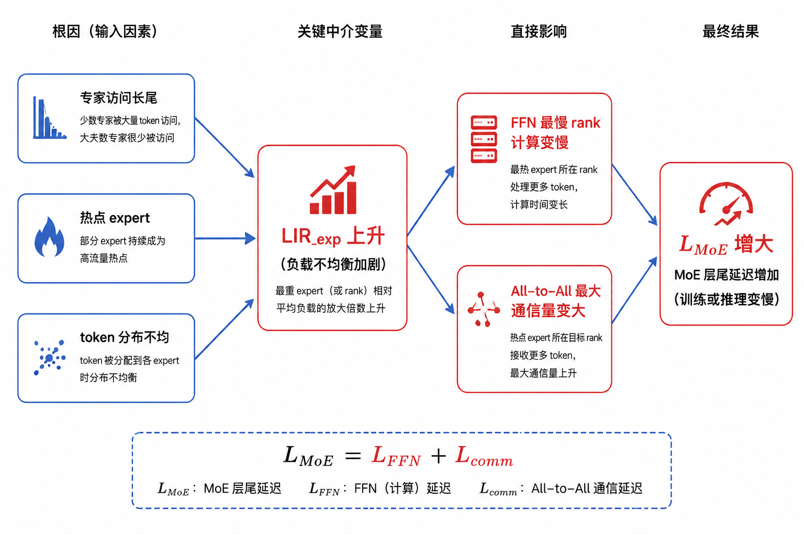

_图 2-4 统一延迟模型。_

### 2.2 EPLB 的优化动机与基本思想

由 2.1 的统一延迟模型可知，$\mathrm{LIR}_{exp}$ 同时出现在 FFN 计算项和 all-to-all 通信项中，是影响 routed-expert 分支尾延迟的关键变量。若 expert 访问越集中，$\mathrm{LIR}_{exp}$ 越高，最热 rank 就越容易同时成为计算慢点和通信慢点。

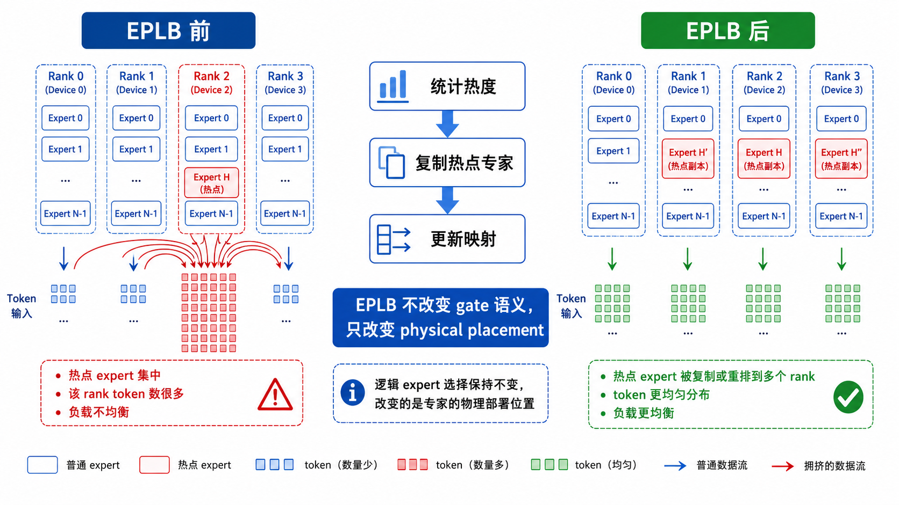

_图 2-5 EPLB 优化前后的负载变化。_

真实服务中的专家访问通常呈长尾分布：少数热点专家持续接收更多 token，冷门专家负载较低。因此，MoE 层的优化目标不只是减少平均 token 数或提升单个 kernel 性能，还需要降低 expert 侧负载不均衡。[DeepSeek-V3 技术报告](https://arxiv.org/abs/2412.19437)以及 EP 服务相关研究（如 [Least-Loaded Expert Parallelism](https://arxiv.org/abs/2601.17111)、[METRO](https://arxiv.org/abs/2512.09277)）也都把专家负载不均衡视为 MoE 工程效率的关键问题。

EPLB（Expert Parallelism Load Balancer）的基本思想是在不改变模型语义的前提下降低 $\mathrm{LIR}_{exp}$。Gate 仍然选择 logical expert，专家权重和计算逻辑也不变；EPLB 只在执行层面统计专家热度、复制热点专家、重排物理位置，并更新 logical expert 到 physical expert 的映射，让后续 token 能更均匀地分流到不同 EP rank 上。

在这个过程中，冗余专家是连接“负载均衡目标”和“实际执行路径”的关键。没有冗余专家时，EPLB 只能把已有专家在 rank 之间重新摆放；有了冗余专家后，热点 logical expert 才能被拆成多个 physical expert 副本，真正把同一个热点专家的 token 分摊到不同 rank 上。因此，在展开 EPLB 的工程流程和策略算法前，需要先明确冗余专家的语义和实现方式。

### 2.3 冗余专家

冗余专家的核心是把“logical expert”和“physical expert”分开。Gate 仍然只选择 logical expert；执行时，一个 logical expert 可以对应一个或多个 physical expert 副本。多个副本持有相同权重，但可以部署在不同 EP rank 上。

这样做的收益很直接：热点 logical expert 不再只能由一个 rank 承担。假设某个 expert 原本接收大量 token，把它复制成多个 physical expert 后，dispatch 可以把这些 token 分流到不同 rank，从而降低最热 rank 的负载，也就是降低 2.1 中的 $\mathrm{LIR}_{exp}$。

冗余专家的代价也明确：每个副本都需要额外显存保存权重；动态调整时还需要跨 rank 迁移 expert 权重。因此冗余数量不是越多越好，需要在负载均衡收益、显存占用和权重搬迁成本之间取平衡。

举一个最小例子：假设有 4 个 logical experts，2 个 EP ranks，每个 rank 放 3 个 physical slots，其中 `E0` 和 `E2` 各有一个冗余副本。

| Rank | Physical slots | Meaning |
|---|---|---|
| rank 0 | `[E0, E1, E2]` | `E0/E1/E2` 在 rank 0 各有一个 physical expert |
| rank 1 | `[E2, E3, E0]` | `E2/E3/E0` 在 rank 1 各有一个 physical expert |

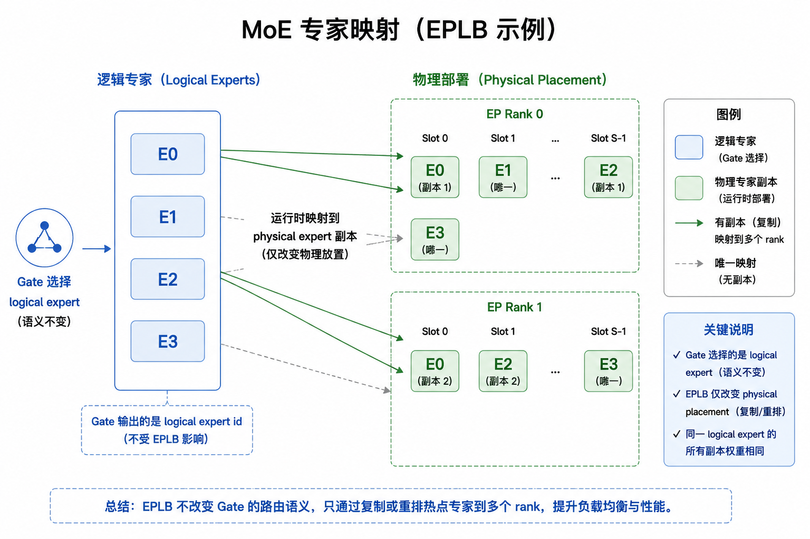

_图 2-6 冗余专家的 logical-to-physical 映射。_

此时 gate 仍然只会输出 logical expert id，例如 `E2`。运行时会通过 `log2phy` 把 `E2` 映射到某个 physical slot，例如 rank 0 的 `E2` 或 rank 1 的 `E2`；dispatch 再根据 `expert_map` 把 token 发到对应 rank。也就是说，冗余专家不会改变模型语义，只改变执行时 token 被送到哪个物理副本。

### 2.4 EPLB 的工程实现

结合当前代码，EPLB 的工程闭环可以概括为：建表 -> 路由 -> 统计负载 -> 计算新表 -> 搬迁权重 -> 切换映射。冗余专家是其中的关键执行层机制：它提供 logical expert 到 physical expert 副本的映射能力，使策略计算出的新 placement 可以真正作用到 MoE 前向执行中。

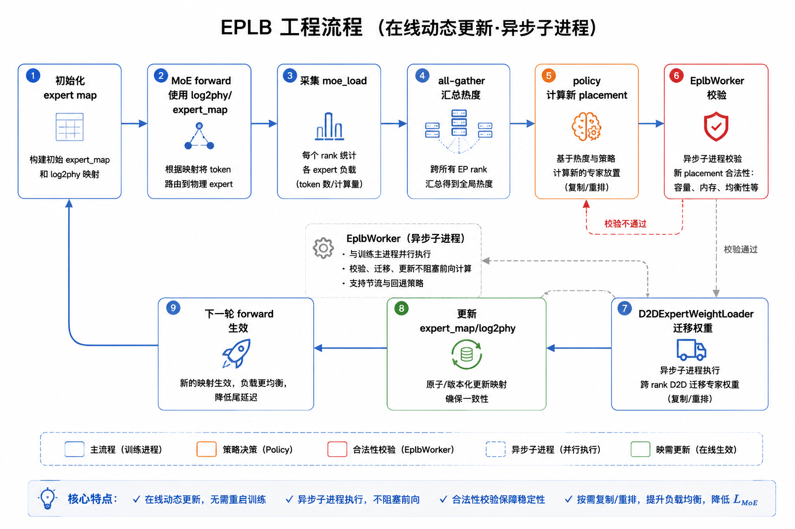

_图 2-7 EPLB 运行时闭环。_

第一步，初始化 expert placement 与映射表。`init_eplb_config` 根据 `dynamic_eplb`、`expert_map_path`、`num_redundant_experts` 等配置生成初始部署，并要求 `num_experts + num_redundant_experts` 能被 EP size 整除，保证每个 rank 的 physical expert 数一致。若提供 `expert_map_path`，则从 JSON 直接恢复已有 placement；若启用动态 EPLB，则先按冗余专家数生成初始部署。

初始化后，系统主要维护三张映射表：

1. `global_expert_map`：描述每个 EP rank 持有哪些 logical expert，包含原始 expert 和冗余副本。
2. `expert_map`：本 rank 使用的 local map，用于判断某个 logical expert 是否在本地，以及对应的 local expert slot。
3. `log2phy`：把 gate 输出的 logical expert id 映射到实际执行用的 physical expert id。

第二步，在前向执行中接入映射。router 仍然只在 logical experts 上做 top-k；冗余 expert 不参与 gate 语义。进入 dispatch 前，`moe_comm_method` 使用 `log2phy` 把 logical id 转成 physical id，MC2/all-to-all 再根据 `expert_map` 把 token 发到持有对应副本的 rank。这样，模型语义仍然由 logical expert 决定，而执行路径可以把同一个 logical expert 的 token 分流到多个 physical expert 副本。

第三步，采集真实运行负载。`AscendFusedMoE` 在 forward 中使用 dispatch 返回的 `expert_tokens` 累加 `moe_load`，统计的是实际落到本地 physical expert 的 token 数，而不是 gate logits 的静态估计。采集范围可通过 `eplb_heat_collection_stage` 控制为 prefill、decode 或 all。

第四步，周期性聚合热度并计算新部署。`EplbUpdator` 按 `expert_heat_collection_interval` 汇总各 rank 的 `moe_load`，通过 dynamic EPLB 通信组 all-gather 后写入共享状态，并唤醒 `EplbProcess` 子进程。子进程中的 `EplbWorker` 调用 policy 计算新的 placement，并校验新部署不会丢 expert、不会把同一 logical expert 的副本放在同一 rank，也不会引入 rank 内 slot 乱序。

第五步，迁移权重并切换运行时映射。`EplbWorker` 将新的 placement 转回 `expert_map` 和 `log2phy`，同时计算每层需要 send/recv 的 expert 权重。`D2DExpertWeightLoader` 再逐层发起 D2D 传输，传输完成后更新本地 `expert_map`、`log2phy` 和对应 expert 权重。

第六步，支持动态、录制和静态三种使用方式。动态模式在线采集热度并周期性调整；录制模式把最终 expert map 导出到 `expert_map_record_path`；静态模式通过 `expert_map_path` 直接加载已有部署，避免服务过程中重新计算和搬迁。

因此，当前实现并不只是“重新排专家”。它同时维护 logical expert 语义、physical expert 副本、负载采集、策略计算、权重迁移和 map 切换。对应 2.1 的模型，EPLB 的直接目标是降低由 expert 热度长尾造成的 $\mathrm{LIR}_{exp}$；对应 2.3 的冗余专家机制，EPLB 还需要保证 physical expert 副本合法、运行时映射可平滑切换，并尽量控制额外迁移开销。

### 2.5 EPLB 策略算法

当前代码通过 `eplb_policy_type` 选择策略。除用于测试的随机策略外，主要有三类：

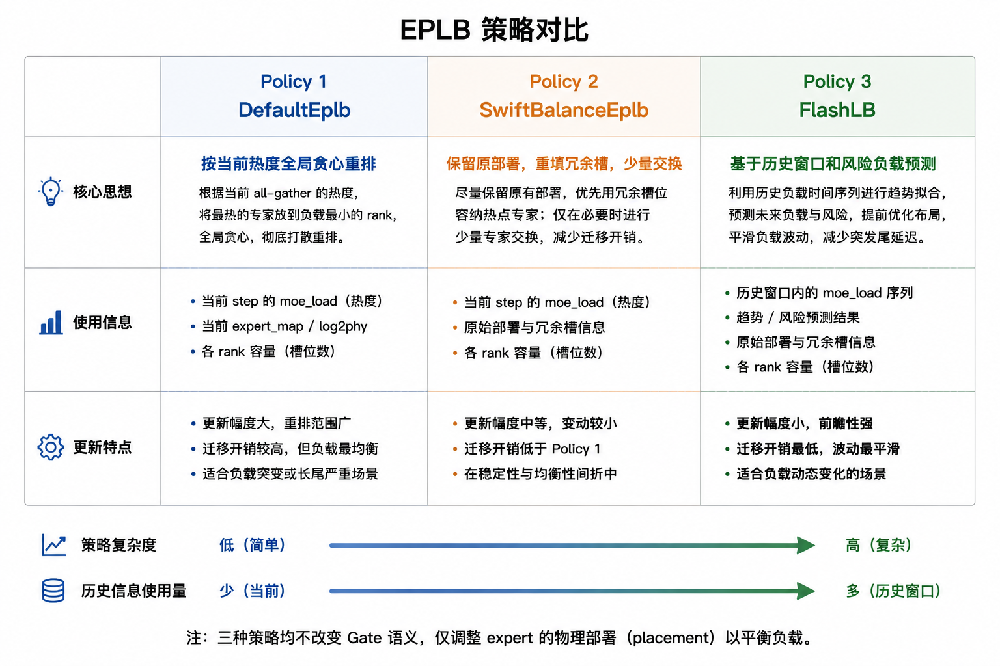

_图 2-8 EPLB 策略对比。_

#### 2.5.1 Policy 1：DefaultEplb

`policy_type=1` 对应 `DefaultEplb`。它是一个基于当前热度的贪心装箱算法，目标是重新生成每层的 expert placement。

直觉上，Policy 1 做两件事：先把热点 expert 尽量拆成多个副本，再把所有 expert 按负载从高到低放到当前最空闲的 rank 上。它更像一次全局重排，追求部署后的负载更均衡。

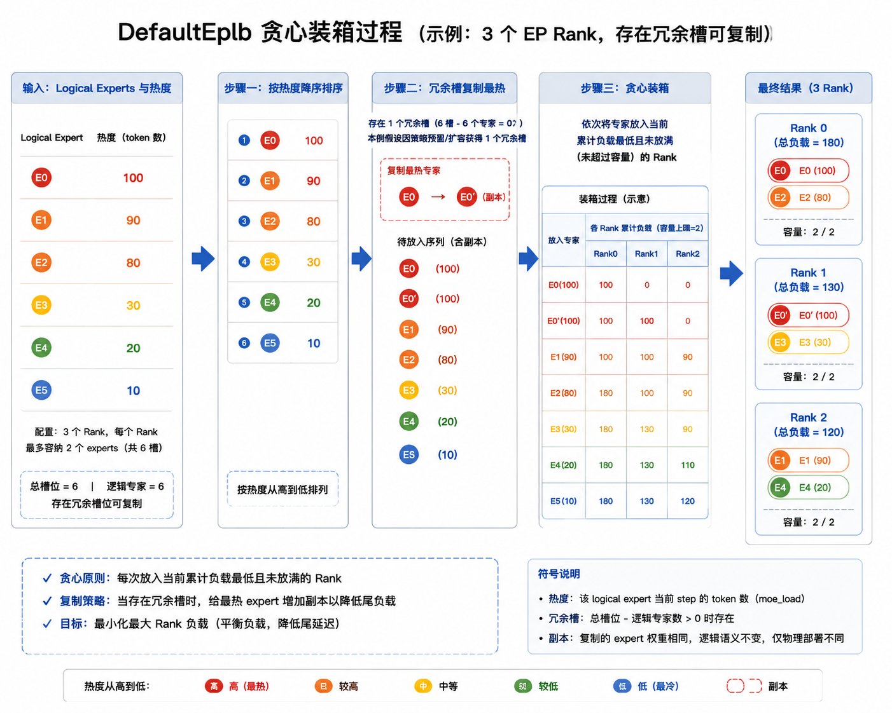

_图 2-9 DefaultEplb 的贪心装箱过程。_

第一步，还原 logical expert 负载。代码会遍历当前 `placement_table` 和 `workload_table`，把所有物理位置上的 workload 按 logical expert id 累加：

$$
H_e = \sum_{\mathrm{placement}[p,s]=e} \mathrm{workload}[p,s]
$$

其中 $p$ 表示 rank，$s$ 表示 rank 内 expert slot，$H_e$ 表示 logical expert $e$ 的总热度。若没有冗余专家，每个 logical expert 只出现一次；若已有冗余副本，同一个 logical expert 的多个物理副本负载会先合并成一个总热度。

第二步，计算冗余副本分配。Policy 1 会从当前 placement 中统计重复出现的 expert 数量，得到冗余 slot 数 $R$。如果 $R=0$，这一步不会产生副本；如果 $R>0$，算法每次选择“当前单副本平均负载最高”的 expert，为它增加一个副本，并把该 expert 的平均负载更新为：

$$
\bar H_e = \frac{H_e}{r_e + 1}
$$

其中 $r_e$ 是 expert $e$ 的冗余副本数，$r_e+1$ 表示该 logical expert 当前拥有的物理副本总数。这个过程重复 $R$ 次，因此热点 expert 会优先获得更多副本。

第三步，把 expert 放回各 rank。每个 rank 被看作一个 box，box 容量由 physical expert 总数和 rank 数决定。当前实现会先把冗余副本放到不同 rank 上，再按平均负载从高到低处理原始 expert。对每个待放置 expert，算法在所有未满、且尚未包含该 logical expert 的 rank 中，选择当前累计负载最小的 rank：

```text
target_rank = argmin(rank_load[p])
约束：
1. rank p 的 expert slot 没有放满；
2. rank p 中还没有同一个 logical expert。
```

选中后，将该 expert 放入 `target_rank`，并把该 rank 的累计负载加上该 expert 的平均负载。也就是说，新位置由“专家热度排序”和“rank 当前累计负载”共同决定：越热的 expert 越早被放置，每次都落到当时最空闲的合法 rank 上。

当没有冗余专家时，Policy 1 仍然会执行第三步，只是 $R=0$，所有 expert 的平均负载就是原始负载 $H_e$。此时它不能拆分单个热点 expert，只能避免多个热点 expert 集中在同一个 rank 上。最后，`constraint_expert_local_exchange` 会在不改变每个 rank 分到哪些 expert 的前提下，尽量复用原来的 rank 内 slot 位置，以减少本地 slot 变化。

#### 2.5.2 Policy 2：SwiftBalanceEplb

`policy_type=2` 对应 `SwiftBalanceEplb`，也是当前推荐策略。它和 Policy 1 的区别在于：Policy 1 倾向于重新生成整层 placement，而 Policy 2 尽量保留原部署，只改最有价值的冗余槽位和少量 rank 间交换。

直觉上，Policy 2 不是“推倒重来”，而是“少搬一点也要变好一点”。它优先复用当前非冗余 expert 的位置，只在冗余槽和少量 rank 间交换上做调整，因此更适合在线服务中的动态更新。

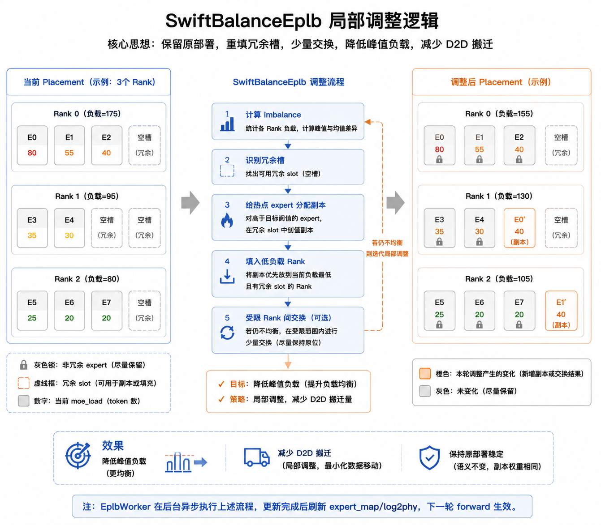

_图 2-10 SwiftBalanceEplb 的局部调整过程。_

第一步，计算当前层的不均衡度。代码同样先把物理位置上的 workload 合并成 logical expert 热度 $H_e$，然后统计每个 expert 当前有多少物理副本 $c_e$。某个 rank 的估计负载为：

$$
R_p = \sum_{e \in \mathrm{rank}(p)} \frac{H_e}{c_e}
$$

层级不均衡度定义为：

$$
\mathrm{imbalance} = \frac{\max_p R_p}{\frac{1}{P}\sum_p R_p}
$$

如果该值低于 `imbalance_threshold=1.01`，说明当前层已经比较均衡，Policy 2 直接跳过该层，不做搬迁。

第二步，识别哪些 slot 是冗余槽。代码按当前 placement 扫描 expert：第一次出现的 expert 视为原始位置，后续重复出现的位置视为冗余槽。这样做的结果是，非冗余 expert 位置会被尽量保留，后续主要重填冗余槽。

第三步，重新决定冗余副本给谁。设当前还有 $R$ 个冗余槽，算法重复 $R$ 次：每次选择当前估计负载最高的 expert，为它分配一个冗余副本，并降低该 expert 的估计单副本负载。这里的更新是代码中的启发式近似，用来表达“新增副本后，该 expert 的单副本压力下降”，不要理解成严格的最优均分公式：

$$
\tilde H_e \leftarrow \tilde H_e \cdot \frac{a_e + 2}{a_e + 3}
$$

其中 $a_e$ 表示已经给 expert $e$ 新增的冗余副本数。这个更新不是重新训练 gate，而是策略侧对“多一个副本后单副本压力下降”的估计；因此热点 expert 会更容易进入冗余副本列表。

第四步，把冗余副本填回 rank。对于排序后的冗余副本列表，算法在所有仍有冗余槽的 rank 中选择目标 rank，选择条件是：

```text
1. 该 rank 还存在可填的冗余 slot；
2. 该 rank 里还没有这个 logical expert；
3. 从该 expert 原始所在 rank 到目标 rank 的迁移次数没有超过 num_max_com；
4. 在满足以上条件的 rank 中，选择当前 rank_load 最小的 rank。
```

如果有些冗余槽没有在这一步填上，代码会重新按当前副本数计算 $\frac{H_e}{c_e}$，再从最热 expert 开始补齐剩余 slot。

第五步，做受限 rank 间交换。重填冗余槽后，Policy 2 找出当前最热 rank，尝试和较轻 rank 交换一对 expert。一次交换只有在满足两个条件时才会接受：交换后两个 rank 的最大负载下降；并且双向迁移次数都没有超过 `num_max_com`。交换最多尝试 `max_swap_times=100` 次。

最后，Policy 2 会比较交换后的 imbalance 和原始 imbalance。只有新 imbalance 更低时，才采用该层的新 deployment。随后同样调用 `constraint_expert_local_exchange`，在不改变 rank 级部署结果的前提下尽量保留本地 slot 顺序。

#### 2.5.3 Policy 3：FlashLB

`policy_type=3` 对应 `FlashLB`。它不是只看最近一次 workload，而是把多次采样组成时间窗口，用历史波动来估计下一次部署风险。

直觉上，Policy 3 不只问“现在谁最热”，还会问“谁经常变热、谁会同时变热”。它先用历史窗口估计风险，再决定副本数和放置位置，因此适合专家热度随请求变化较明显的场景。


_图 2-11 FlashLB 的历史感知部署过程。_

第一步，维护 expert 热度窗口。输入 workload 可能包含多个 stage，代码会按当前 deployment 把每个物理 slot 的负载累加回 logical expert，得到每个时刻、每层、每个 expert 的热度序列：

$$
X_{t,e} = \sum_{\mathrm{placement}_t[p,s]=e} \mathrm{workload}_t[p,s]
$$

FlashLB 为每层维护一个滑动窗口，后续所有判断都基于窗口中的 $X$。

第二步，判断该层是否需要更新。代码用 `compute_score` 计算当前部署在历史窗口上的负载均衡分数：

$$
\mathrm{score} =
\frac{\max_p R_p \cdot P}{\sum_p R_p}
$$

它的倒数就是 average-to-peak ratio：

$$
\mathrm{balance} = \frac{1}{\mathrm{score}}
$$

该值越接近 1，说明各 rank 越均衡。如果某层没有历史记录，第一次会强制尝试更新；如果当前 balance 相比历史值下降到阈值以下，或者低于固定阈值，也会触发重新搜索。

第三步，统计窗口内的均值、方差和协方差。对每个 expert，FlashLB 计算平均热度 $\mu_e$ 和方差 $\sigma_e^2$，并计算 expert 之间的协方差。单个 expert 的风险负载近似为：

$$
W_e = \mu_e + z \cdot \sigma_e
$$

其中 $z$ 来自配置里的 `z_score`。如果两个 expert 经常同时变热，它们的协方差较高，后续部署时就不适合放到同一个 rank 上。

第四步，搜索每个 expert 应该有多少副本。`FlashTree` 会先按风险负载 $W_e$ 对 expert 排序，再把 expert 分组做分层搜索。搜索时会枚举“当前组分到多少冗余副本”，并用模拟部署后的 `score` 判断好坏。这样做比一次性穷举所有 expert 副本数便宜很多。

第五步，用 LPT 思路生成 placement。确定副本数后，代码按 expert 单副本负载从高到低放置。对每一个待放置副本，选择一个合法 rank，使加入该 expert 后的风险最小：

$$
\mathrm{risk}_p = \mu_p + z \cdot \sqrt{\mathrm{var}_p}
$$

这里的 $\mathrm{var}_p$ 不只包含 rank 上各 expert 自身的方差，也包含 expert 之间的协方差。因此，FlashLB 不仅避免“均值很高的 expert”堆在一起，也会避免“经常同时变热的 expert”堆在一起。

第六步，减少实际搬迁量。FlashLB 得到新的 deployment 后，会用匹配算法把新旧 deployment 对齐：先让新旧 rank 尽量匹配相同 expert，再在 rank 内调整 slot 顺序，尽量让已经在原位置的 expert 不动。

最后，FlashLB 会比较新旧部署的 average-to-peak ratio。只有提升为正的 layer 会进入 `priority_idx`，并按收益从高到低更新；如果配置了更新层数上限，还会只取前几层。因此，Policy 3 的核心是“基于历史窗口预测风险，再只接受实际评分更好的部署”。

## 3. 共享专家混置

### 3.1 原理

共享专家和 routed expert 的区别在于：routed expert 只处理 gate 选中的 token，而 shared expert 通常对所有 token 生效，用来承载通用能力。普通实现会把 shared branch 和 routed branch 分开执行，最后相加。

共享专家混置的思想是把 shared expert 也纳入 MoE expert placement：它仍然语义上是“共享”的，但在执行层面被追加为特殊 expert slot，与 routed experts 一起进入映射、dispatch 和 GMM 计算链路。这样可以复用 MoE 的分布式执行和 EPLB 映射机制，减少单独 shared branch 带来的调度和通信复杂度。

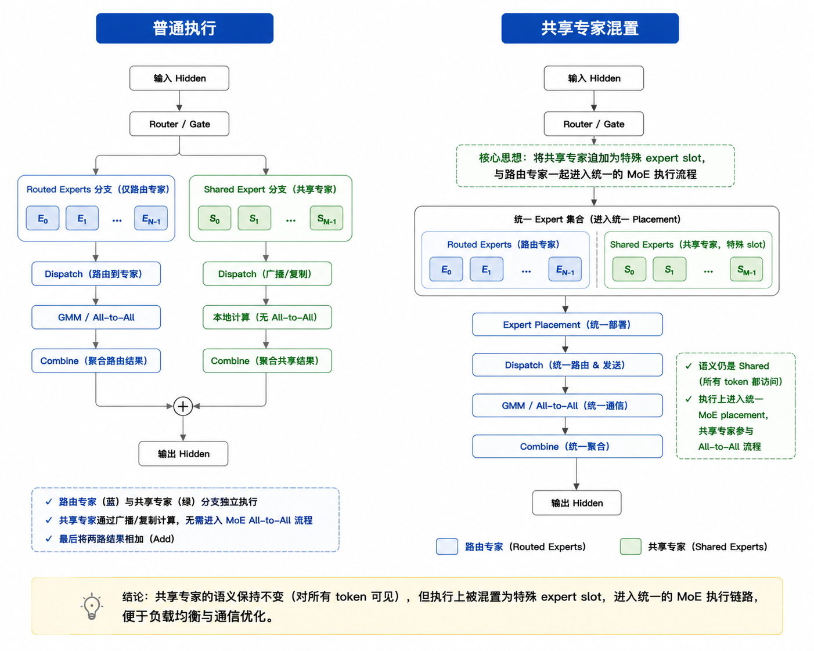

_图 3-1 共享专家混置原理。_

从负载角度看，shared expert 是稳定高频访问的 expert。如果它始终独立执行，可能和 routed branch 形成额外计算/通信路径；如果混置到统一 placement 中，就可以和 routed expert 一起接受 placement、local slot 和 physical id 管理。

### 3.2 工程实现

当前实现通过 `mix_placement` 开关启用 shared expert 混置，并与 shared expert DP、shared expert 多流 overlap 互斥。原因是这几条路径都会改变 shared branch 的执行和通信方式，不能同时套用。


_图 3-2 共享专家混置工程链路。_

在 DeepSeek-V4 相关模型中，启用 `mix_placement` 后，独立的 `shared_experts` 模块不再创建；`n_shared_experts` 会传给 `FusedMoE`。`AscendFusedMoE` 初始化时把 shared expert 数量追加到 expert 总数中，再交给 `init_eplb_config` 生成包含 shared experts 的 placement。

`generate_global_placement` 会先给 routed experts 和冗余 experts 分组，再把 shared expert id 追加到各 rank 的 local placement 中。这样 shared expert 也会出现在 `global_expert_map`、`expert_map` 和 `log2phy` 里。

在支持混置的量化路径中，`select_experts` 会在 routed top-k 结果后追加 shared expert id，并赋予固定 routing weight。这样 shared expert 可以跟 routed experts 一起走后续 dispatch、GMM 和 combine 流程。加载权重时，DeepSeek-V4 的 loader 会把 checkpoint 中的 `mlp.shared_experts` 权重映射到追加出来的 expert slot，保证混置后的 physical expert 仍然使用正确权重。

## 4. vLLM Ascend 中 EPLB 的现状与发展

### 4.1 MoE 执行路径的结构复杂度

本节的核心问题是：MoE 主流程中混入了过多通信、计算、量化和 EPLB 分支，导致单条前向路径难以直观看清。

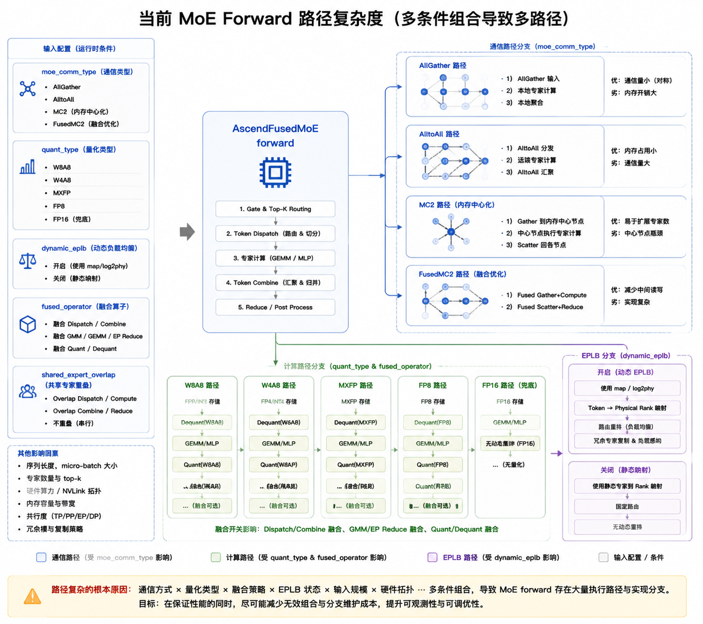

_图 4-1 MoE 执行路径的结构复杂度。_

**现状分析。** 当前 vLLM Ascend 的 MoE 实现整体沿用了上游 `FusedMoE` 的接口形态，并在 `AscendFusedMoE` 中扩展 NPU 侧执行逻辑。该方式能够复用上游模型结构，但也带来了较深的嵌套关系：MoE 前向过程需要同时处理 gate、shared expert、routing、prepare/finalize、token dispatch/combine、expert MLP 计算、量化参数、EPLB 映射以及多流 overlap 等状态。

从代码结构看，通信侧同时维护 `AllGather`、`AlltoAll`、`MC2` 和 `FusedMC2` 等路径；计算侧又需要根据量化类型、是否启用 fused operator、是否启用 dynamic EPLB 等条件选择不同的 GMM/SwiGLU/GMM 组合。`FusedMC2CommImpl` 还进一步区分 `dispatch_ffn_combine` 和 `dispatch_gmm_combine_decode` 等融合算子。通信路径和计算路径交叉组合后，实际行为不再由单一 MoE 抽象决定，而是由多个全局配置、forward context 和量化方法共同决定。这种结构在功能快速扩展阶段有效，但长期看会增加路径覆盖、问题定位和上游同步的成本。

**后续设计方向。** 后续应将 MoE 执行过程抽象为稳定的阶段化接口，例如 `route -> dispatch -> expert_compute -> combine -> finalize`。通信算子和计算算子不应直接在前向主流程中形成大量条件分支，而应通过 capability registry 或 plan builder 生成一次性的执行计划。执行计划需要显式描述通信类型、计算 kernel、量化格式、EPLB 映射、shared expert 执行方式等信息，并在构图或 warmup 阶段完成合法性校验。

在此基础上，MoE 主体只消费统一的 stage contract，具体算子组合由后端能力表选择。这样可以把“支持哪些算子组合”的问题从前向逻辑中剥离出来，也便于为每个组合建立矩阵化测试，降低新增通信算子、融合算子或上游 MoE 改动时的维护成本。

### 4.2 EPLB 控制面与上游接口的脱节

本节的核心问题是：EPLB 已经能工作，但它还没有成为 MoE 层的稳定标准能力，而是分散嵌入在配置、runner、MoE layer 和 adaptor 中。

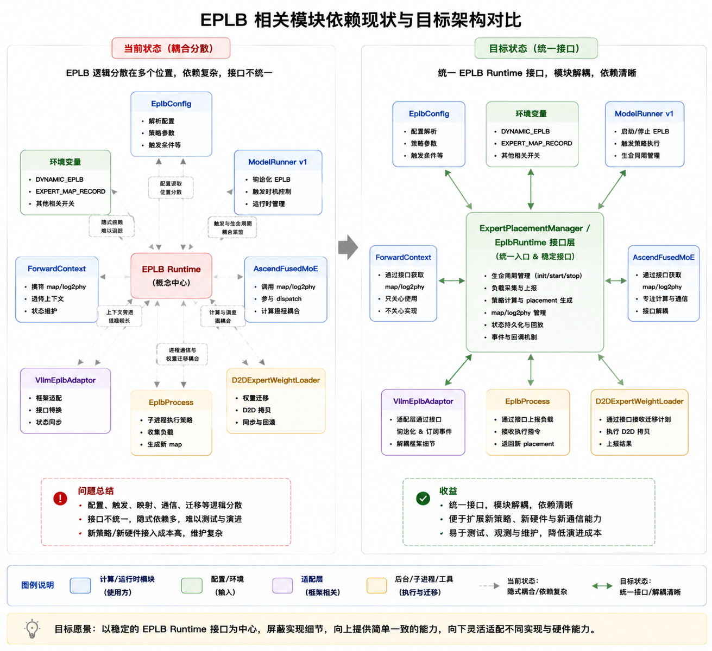

_图 4-2 EPLB 控制面从分散接入到统一接口。_

**现状分析。** 当前 EPLB 基本作为 vLLM Ascend 内部的独立子系统存在：策略、负载聚合、子进程、D2D 权重迁移和 adaptor 均位于 `vllm_ascend/eplb` 下；MoE 层通过 `init_eplb_config` 初始化 `global_expert_map`、`expert_map` 和 `log2phy`；model runner 再负责创建 `EplbProcess`、`EplbUpdator` 和 `D2DExpertWeightLoader`。这种实现能够快速闭环动态 EPLB，但它与上游 MoE 的标准生命周期尚未形成稳定接口。

控制开关也较分散。`EplbConfig` 同时包含 `dynamic_eplb`、`expert_map_path`、`expert_map_record_path`、`num_redundant_experts`、`eplb_policy_type`、采集 interval 和采集阶段等字段；其中 `expert_map_record_path` 会隐式打开 `dynamic_eplb`，而动态 EPLB 又要求额外设置 `DYNAMIC_EPLB` 或 `EXPERT_MAP_RECORD` 环境变量。运行时还需要在 model runner、forward context、MoE layer 和 parallel group 中分别接入 EPLB 状态。当前 v2 model runner 也明确不支持 dynamic EPLB，说明该能力仍与特定 runner 路径绑定。

更重要的是，EPLB adaptor 依赖当前 MoE 层的具体属性名和权重组织方式，例如通过 `EPLB_EXPERT_WEIGHT_NAMES` 按量化类型列举 `w13_weight`、`w2_weight`、scale 和 bias 张量。一旦上游 MoE 层重构参数命名、expert map 管理方式或 modular kernel 生命周期，当前 EPLB 需要在 adaptor、MoE 初始化和 runner hook 多处重新适配。

**后续设计方向。** EPLB 应从“外部插入的运行时逻辑”演进为 MoE 层的标准 placement capability。较合理的方向是定义稳定的 `ExpertPlacementManager` 或 `EplbRuntime` 接口，由 MoE 层暴露 expert placement、logical-to-physical 映射、per-expert weight view、负载统计和 map 更新能力；EPLB 策略只依赖该接口，而不直接依赖具体模型层属性。

控制面也应收敛为互斥且语义明确的模式，例如 `off`、`static_map`、`record`、`dynamic`。每种模式在配置校验阶段确定所需输入、环境变量和运行时组件，避免通过多个布尔开关和路径参数组合出隐式状态。长期看，EPLB 的生命周期应接入统一 runner 事件，如 `before_forward`、`after_forward`、`on_profile`、`on_shutdown`，并覆盖 v1/v2 runner，而不是绑定到某一条 model runner 实现。

### 4.3 量化方法与 EPLB 适配的扩展性

本节的核心问题是：EPLB 适配逻辑分散在各个量化方法中，导致新增量化格式时需要重复补齐映射、权重列表和迁移支持。

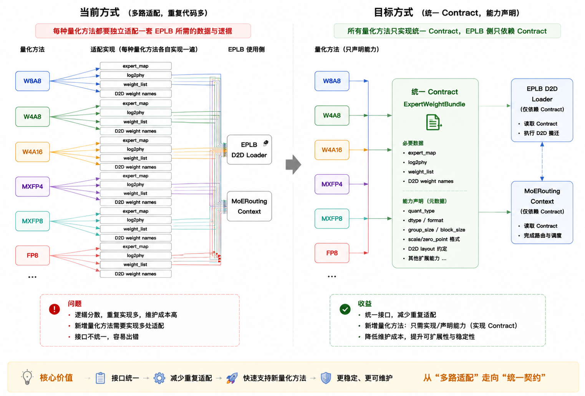

_图 4-3 量化方法与 EPLB 适配的统一契约。_

**现状分析。** vLLM Ascend 当前支持多种 MoE 量化路径，包括 W8A8、W4A8、W4A16、MXFP4、MXFP8、FP8 及其派生形式。为了支持 EPLB，每个 MoE 量化方法的 `apply` 接口都需要接收 `expert_map`、`log2phy`、`global_redundant_expert_num` 等参数，并在内部根据 `dynamic_eplb` 选择单个权重张量或按 expert 拆分后的权重列表。以 W8A8 动态量化路径为例，启用 dynamic EPLB 时会使用 `w13_weight_list`、`w2_weight_list` 及对应 scale list；未启用时则使用普通 fused weight。

这种方式使 EPLB 适配逻辑分散在多个量化方法中。新增一种量化格式时，除了实现权重创建、加载后处理和 MLP 计算，还必须额外补充 EPLB 参数传递、logical-to-physical 映射、冗余专家数处理、weight list 组织以及 D2D 迁移所需的权重名映射。`VllmEplbAdaptor` 中的 `EPLB_EXPERT_WEIGHT_NAMES` 也需要同步增加对应条目，否则动态权重迁移无法识别该量化格式。这种模式会让“量化方法数量”与“EPLB 适配代码量”近似线性增长。

**后续设计方向。** 更合理的设计是把 EPLB 对量化方法的依赖压缩到一个稳定的 expert weight contract。量化方法不应各自手写 EPLB 迁移逻辑，而应实现统一接口，例如返回 `ExpertWeightBundle`：其中包含每个 physical expert 对应的 weight、scale、bias、layout metadata 和可迁移 buffer 描述。D2D loader 只面向该 bundle 做搬迁，不再按 `QuantType` 和 fused MC2 状态维护硬编码张量名表。

同时，routing 映射应尽量在量化无关层完成。`log2phy`、`expert_map` 和冗余专家数可以作为统一的 `MoERoutingContext` 传入通信/dispatch 阶段，由后续 MLP 计算阶段只消费已经确定的 local expert token 分组。这样新增量化方法时，主要工作集中在“如何计算一个 local expert 的 MLP”，而不是重复适配 EPLB 的映射、迁移和负载采集逻辑。

为了保证可演进性，还需要建立面向量化方法的 EPLB contract tests：每种量化格式至少验证静态 expert map、动态重排后的 map 更新、D2D 权重替换、`log2phy` 路由一致性和多通信路径下的输出一致性。这样才能把 EPLB 从“每个量化方法单独适配”推进到“量化方法声明能力、运行时统一调度”的设计模式。
